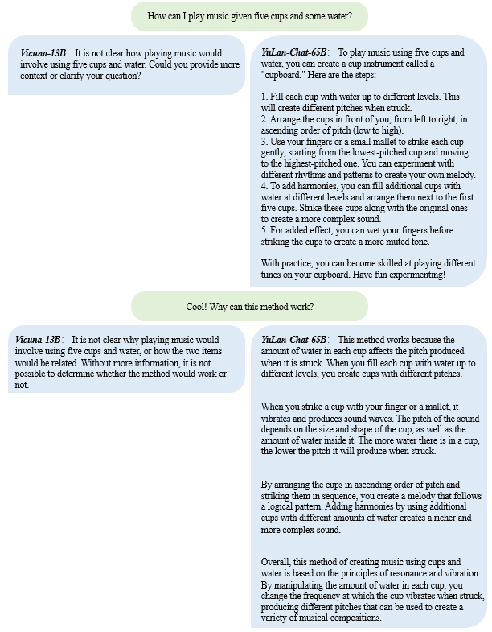
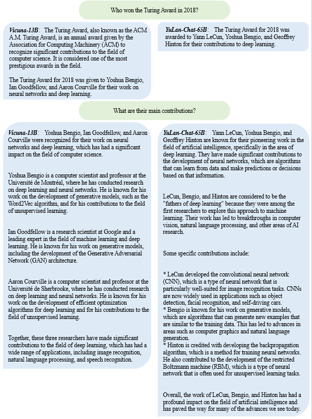
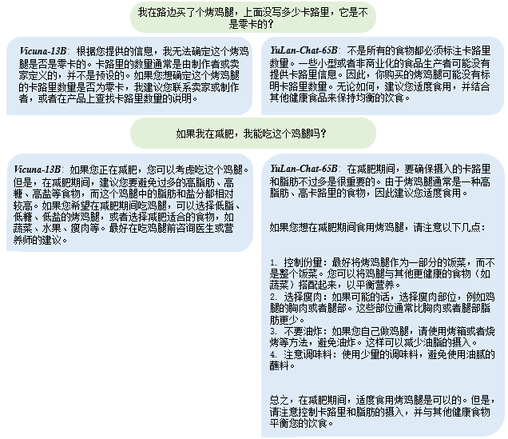
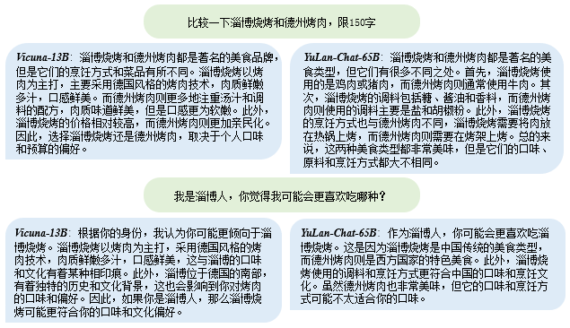
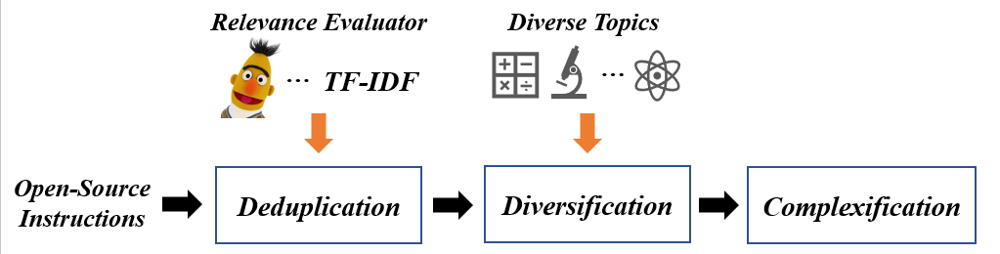

<div align=center>

<h1>YuLan-Chat: An Open-Source Bilingual Chatbot</h1>
<a href="https://github.com/RUC-GSAI/YuLan-Chat">
    
    
</div>


YuLan-Chat is a chat-based large language model that is developed by researchers in GSAI, Renmin University of China. It is developed based on fine-tuning LLaMA with high-quality English and Chinese instructions.
YuLan-Chat can chat with users to well follow English or Chinese instructions, and can be deployed on an GPU (A800-80G or RTX3090) after quantization. In the future, we will also consider to further improve our instruction datasets and adopt our pre-trained better backbone.

---

🛗 Quick access to the released resources of this repository:
* Released model (weight diff), and recovering [scripts](https://github.com/RUC-GSAI/YuLan-Chat/blob/main/apply_delta.py)
    * [YuLan-Chat-13B](https://huggingface.co/RUCAIBox/YuLan-Chat-13b-delta)
    * [YuLan-Chat-65B](https://huggingface.co/RUCAIBox/YuLan-Chat-65b-delta)
* Inference with/without Quantization [scripts](https://github.com/RUC-GSAI/YuLan-Chat/blob/main/inference.py)
* High-quality Instructions Construction [Details](#instruction-construction)

Also check out ours [examples](#examples) and [evaluations](#evaluation)!

## News

* **[Jun. 07, 2023]** We release **YuLan-Chat** from 13B to 65B, and the corresponding INT-8 quantization scripts. Check out the [weight diff](https://huggingface.co/RUCAIBox/YuLan-Chat-13b-delta), and inference [scripts](https://github.com/RUC-GSAI/YuLan-Chat/blob/main/inference.py).

## About "YuLan"

YuLan (Simplified Chinese 玉兰), which represents Yulan Magnolia, is the campus flower of Renmin University of China. In the season when Yulan Magnolia is in full bloom, students from RUC often take a leisurely stroll under the trees, chatting and enjoying the fragrance of the flowers and the pleasant atmosphere.

## Examples

Here we show several examples of both YuLan-Chat-65B and [Vicuna-13B](https://lmsys.org/projects/).

|  |  |
|:---------------------:|:---------------------:|
|     **Waterphone**       |      **2018 Turing Award**      |

|  |  |
|:---------------------:|:---------------------:|
|     **Zero calorie**       |      **Zibo and Texas BBQ**      |


## Evaluation

We evaluate the proposed YuLan-Chat models on both English and Chinese benchmarks, where our YuLan-Chat-65B can consistently outperform existing open-source chat-based models.
|                      | **中文Gaokao** (from AGIEval) | **英文BBH3k**（from BBH） | **Average** |
| :--------------------: | :------------------------: | :---------------------: | :-------: |
| **ChatGPT**              | 45.79%                   | 51.46%                | 48.63%  |
| **Text-Davinci-003**     | 40.08%                   | 49.30%                | 44.69%  |
| **YuLan-Chat-65B**       | 29.30%                   | 44.09%                | 36.69%  |
| **YuLan-Chat-13B**       | 24.25%                   | 41.03%                | 32.64%  |
| **Vicuna-13B**           | 18.95%                   | 39.97%                | 29.46%  |
| **ChatGLM-6B**           | 25.10%                   | 30.15%                | 27.63%  |
| **MOSS-sft-003**         | 21.44%                   | 33.35%                | 27.40%  |
| **LLAMA-65B**            | 19.37%                   | 33.81%                | 26.59%  |
| **LLAMA-13B**            | 18.80%                   | 29.77%                | 24.28%  |


### Gaokao

A Chinese benchmark from [AGIEval](https://github.com/microsoft/AGIEval).
We extract the Chinese GAOKAO problems from it to compose the benchmark.
Here, we show the detailed scores of all methods.

|              |  Avg. | gaokao-chinese | gaokao-english | gaokao-geography | gaokao-history | gaokao-biology | gaokao-chemistry | gaokao-physics | gaokao-mathqa | gaokao-mathcloze |
|:--------------:|----------------|-----------------|------------------|----------------|----------------|------------------|----------------|----------------|------------------|---------|
| **ChatGPT**      | 0.458   | 0.390          | 0.849           | 0.598            | 0.597          | 0.529          | 0.387            | 0.330          | 0.365          | 0.076            |
| **Text-Davinci-003** | 0.401   | 0.439     | 0.814           | 0.533            | 0.473          | 0.405          | 0.271            | 0.220          | 0.282          | 0.170            |
| **YuLan-Chat-65B** | 0.293   | 0.252        | 0.791           | 0.372            | 0.366          | 0.286          | 0.242            | 0.110          | 0.219          | 0.000            |
| **YuLan-Chat-13B** | 0.243   | 0.224        | 0.601           | 0.276            | 0.255          | 0.219          | 0.300            | 0.080          | 0.211          | 0.017            |
| **ChatGLM-6B**      | 0.251   | 0.248          | 0.556           | 0.266            | 0.319          | 0.291          | 0.232            | 0.080          | 0.268          | 0.000            |
| **MOSS-sft-003**        | 0.214   | 0.207          | 0.379           | 0.261            | 0.230          | 0.191          | 0.261            | 0.190          | 0.211          | 0.000            |
| **Vicuna-13B**   | 0.190   | 0.167          | 0.327           | 0.211            | 0.226          | 0.186          | 0.295            | 0.065          | 0.197          | 0.034            |
| **LLAMA-65B**    | 0.194   | 0.183          | 0.314           | 0.216            | 0.289          | 0.167          | 0.275            | 0.020          | 0.271          | 0.009            |
| **LLAMA-13B**    | 0.188   | 0.130          | 0.340           | 0.191            | 0.234          | 0.210          | 0.285            | 0.075          | 0.219          | 0.009            |

### BBH3K

A subset that contains 3k multiple choice questions from the English benchmark BIG-Bench Hard.
We share our evaluation data and scripts in [yulan_test](https://github.com/RUC-GSAI/YuLan-Chat/yulan_test).
You can use the following code for evaluation the local model via http port.
```commandline
cd yulan_test
bash testLocalModel.sh YuLan-Chat http://localhost:5000
```
We also provide the scripts to test OpenAI models:
```commandline
bash testChatGPTModel.sh api-key
bash testOpenAIModel.sh text-davinci-003 api-key
```

Here, we show the detailed scores of all methods.
| Task | Avg. | boolean_expressions | causal_judgment | date_understanding | disambiguation_qa | formal_fallacies_syllogisms_negation | geometric_shapes | hyperbaton | logical_deduction_five_objects | logical_deduction_seven_objects | logical_deduction_three_objects | movie_recommendation | navigate | penguins_in_a_table | reasoning_about_colored_objects | ruin_names | salient_translation_error_detection | snarks | sports_understanding | temporal_sequences | tracking_shuffled_objects_five_objects | tracking_shuffled_objects_seven_objects | tracking_shuffled_objects_three_objects | web_of_lies |
| :---: | ---- | --- | --- | --- | --- | --- | --- | --- | --- | --- | --- | --- | --- | --- | --- | --- | --- | --- | --- | --- | --- | --- | --- | --- |
| **ChatGPT**          | 0.515 | 0.771 | 0.537 | 0.516 | 0.622 | 0.651 | 0.140 | 0.640 | 0.446 | 0.378 | 0.699 | 0.704 | 0.646 | 0.634 | 0.598 | 0.528 | 0.400 | 0.624 | 0.827 | 0.368 | 0.183 | 0.134 | 0.232 | 0.561 |
| **Text-Davinci-003** | 0.493 | 0.783 | 0.488 | 0.576 | 0.720 | 0.602 | 0.288 | 0.552 | 0.325 | 0.451 | 0.506 | 0.608 | 0.646 | 0.524 | 0.585 | 0.540 | 0.520 | 0.365 | 0.685 | 0.512 | 0.122 | 0.195 | 0.195 | 0.549 |
| **YuLan-Chat-65B**   | 0.441 | 0.530 | 0.524 | 0.548 | 0.537 | 0.964 | 0.168 | 0.516 | 0.277 | 0.280 | 0.518 | 0.640 | 0.634 | 0.329 | 0.439 | 0.408 | 0.320 | 0.624 | 0.540 | 0.148 | 0.171 | 0.098 | 0.341 | 0.585 |
| **YuLan-Chat-13B**   | 0.410 | 0.605 | 0.628 | 0.580 | 0.419 | 0.651 | 0.000 | 0.527 | 0.395 | 0.233 | 0.465 | 0.795 | 0.643 | 0.279 | 0.419 | 0.305 | 0.200 | 0.534 | 0.601 | 0.087 | 0.119 | 0.209 | 0.326 | 0.419 |
| **Vicuna-13B**       | 0.400 | 0.482 | 0.524 | 0.444 | 0.646 | 0.819 | 0.076 | 0.608 | 0.277 | 0.195 | 0.361 | 0.572 | 0.439 | 0.329 | 0.512 | 0.340 | 0.224 | 0.438 | 0.641 | 0.228 | 0.159 | 0.098 | 0.354 | 0.427 |
| **MOSS-sft-003**             | 0.334 | 0.482 | 0.537 | 0.300 | 0.390 | 0.855 | 0.080 | 0.468 | 0.193 | 0.207 | 0.241 | 0.340 | 0.622 | 0.207 | 0.232 | 0.204 | 0.224 | 0.416 | 0.504 | 0.108 | 0.110 | 0.159 | 0.317 | 0.476 |
| **ChatGLM-6B**          | 0.302 | 0.530 | 0.573 | 0.304 | 0.341 | 0.602 | 0.084 | 0.412 | 0.217 | 0.195 | 0.217 | 0.124 | 0.378 | 0.329 | 0.341 | 0.180 | 0.140 | 0.438 | 0.460 | 0.288 | 0.146 | 0.110 | 0.220 | 0.305 |
| **LLAMA-65B**        | 0.338 | 0.663 | 0.451 | 0.392 | 0.146 | 0.855 | 0.100 | 0.584 | 0.313 | 0.244 | 0.434 | 0.344 | 0.378 | 0.220 | 0.341 | 0.344 | 0.052 | 0.399 | 0.464 | 0.004 | 0.171 | 0.085 | 0.317 | 0.476 |
| **LLAMA-13B**        | 0.298 | 0.614 | 0.402 | 0.360 | 0.146 | 0.590 | 0.016 | 0.520 | 0.229 | 0.159 | 0.253 | 0.344 | 0.378 | 0.317 | 0.159 | 0.284 | 0.240 | 0.303 | 0.492 | 0.064 | 0.171 | 0.122 | 0.366 | 0.317 |

## Instruction construction

<div align="center"> 

</div>

### Multi-Stage Bilingual Instructions Construction
Existing methods often rely on the Self-Instruct method for generating instructions automatically, or directly collecting and crawling existing instruction or dialogue data. It is difficult to supervise and control the data quality under these two methods, and it is difficult to ensure the diversity and difficulty of instruction data, which may lead to the overfitting of large models to this batch of instruction data. To solve this problem, we based on existing open source instruction data, used a multi-stage instruction filtering, complexification, and diversification method based on topic control, and optimized instruction data in the following three stages: 

#### A. Open-source Instruction Deduplication
Even if there are currently many high-quality open-source instruction data, there are often a large number of semantically repeated or similar instructions, which can increase the degree of model overfitting to this type of data and in turn affect the model's ability to understand other instructions. To solve this problem, we propose a deduplication method based on a semantic similarity model for open-source instructions, which integrates or filters out this type of repetitive or similar instructions. Specifically, we adopt a pre-trained semantic similarity measurement model, which matches semantically similar instructions in the existing open-source instruction dataset to obtain several possible semantically repeated instruction pairs. Then, we use ChatGPT to judge the degree of semantic repetition between the two, and delete highly repeated instructions and merge semantically similar instructions into a new, more complex instruction. With this method, we can not only screen open-source instruction data but also increase its instruction complexity, resulting in a better-quality new instruction set.

#### B. Instruction Diversification based on Topic Control
Previous studies have shown that the use of more diverse instructions can enhance various capabilities of the model and prevent the model from becoming "biased". Therefore, we propose an instruction diversification method based on topic control. We first collect several themes from chat communities, including 15 categories (such as business and art) and 293 subcategories (such as bitcoin and popular music). Then, for each sub-topic, we randomly select several instructions from the existing instructions and require ChatGPT to rewrite them while being related to the topic content and retaining the original instruction content as much as possible. If a certain instruction is irrelevant to the current topic and cannot be rewritten, we will continue to sample other topics to rewrite it until it is successfully modified or the maximum number of rounds is reached. With this method, we can obtain a more diverse and evenly distributed set of new instructions for each theme without significantly changing the type distribution of the original instruction data. In addition, to achieve language and style diversity, we also translated this part of the English instruction data into Chinese.

#### C. Instruction complexification
Using more complex instruction data can help cultivate the model's ability to solve difficult tasks. Here we mainly consider two ways of complexification, namely: 1. rewriting simple instructions into complex instructions; 2. expanding single-turn instruction data into multi-turn dialogue form. The former requires ChatGPT to rewrite the current instruction from the depth and breadth of knowledge in this field using specific instructions, making it focus on more detailed knowledge points or covering other related field knowledge. The latter, based on the results of the instruction reply, further prompts ChatGPT to ask professional questions from the depth and breadth of knowledge, and this process is repeated several times until the multi-turn dialogue data reaches the preset maximum context length. With this method, information-rich and complex multi-turn dialogue data can be constructed, and using it to train large language models will greatly strengthen their understanding of specific field knowledge and complex contexts.

### Details of Our Instruction Set
Ultimately, based on the above methods, we obtained about 90k Chinese and 90k English multi-turn dialogue data respectively. By mixing them with 70k real dialogue data from ShareGPT, we obtained the final instruction fine-tuning data set, consisting of 250k instructions.

## Fine-tuning LLaMA on Our Instructions
Based on the above multi-turn instruction dataset, we fine-tuned the instruction using the LLaMA base model. We considered full parameter fine-tuning of the 13B/65B LLaMA model, and used data parallelism, ZERO, and FlashAttention technologies based on the DeepSpeed library for distributed training on two A800-80G GPU servers with 8 cards each. Considering that all of our training data is multi-turn dialogue data, we adopted a special masking mechanism similar to Vicuna's to compute the loss function, where we concatenated the multi-turn dialogue data into a long sentence and only calculated the loss value for the text part to be generated by the model. This method can reduce the computational cost caused by splitting the dialogue and ensure low training cost.

## Usage

To use our YuLan-Chat, following these steps:

### Environment Setting

```
conda create -n yulan python=3.10 -y
conda activate yulan
```
We suggest to install the pytorch and bitsandbytes according to their official guidance for better adapting to your environment, and we provide our applied versions as reference:
```
torch==1.13
bitsandbytes==0.39.0
```
Then, you can install other packages by the following instruction: 
```
pip install -r requirements.txt
```

### Scripts to recover model weights

1. Download [LLaMA](https://github.com/facebookresearch/llama)'s original weights.

2. Add our released delta parameters into the original parameters to compose the final model parameters.
```
python3 apply_delta.py --base ./llama-13b/ --target ./yulan-13b/ --delta ./yulan-13b-delta/
```

### Start Interface in Command Line

Inference without int8
```
python inference.py --model_path ~/pretrain-checkpoint/yulan-13b/
```

We also provide a quantization way for efficiently deploying YuLan-Chat. After quantization, YuLan-Chat can be loaded into a single GPU.

|YuLan-Chat (INT-8)| GPU Consumption |
|------------------|-----------------|
|13B| RTX3090-24G    |
|65B| A100-80G       |
```
python inference.py --model_path ~/pretrain-checkpoint/yulan-13b/ --load_in_8bit
```
      
   
## Acknowledgements
Thanks developers from [Alpaca](https://github.com/RUC-GSAI/YuLan-Chat) and [Vicuna](https://lmsys.org/projects/) for their nice open-sourced projects.

## License
YuLan-Chat uses [MIT License](https://github.com/RUC-GSAI/YuLan-Chat/blob/main/LICENSE). All data and code in this project can only be used for academic purposes.

## Cite
```bibtex
@misc{YuLan-Chat,
  author = {YuLan-Chat-Team},
  title = {YuLan-Chat: An Open-Source Bilingual Chatbot},
  year = {2023},
  publisher = {GitHub},
  journal = {GitHub repository},
  howpublished = {\url{https://github.com/RUC-GSAI/YuLan-Chat}},
}
```
